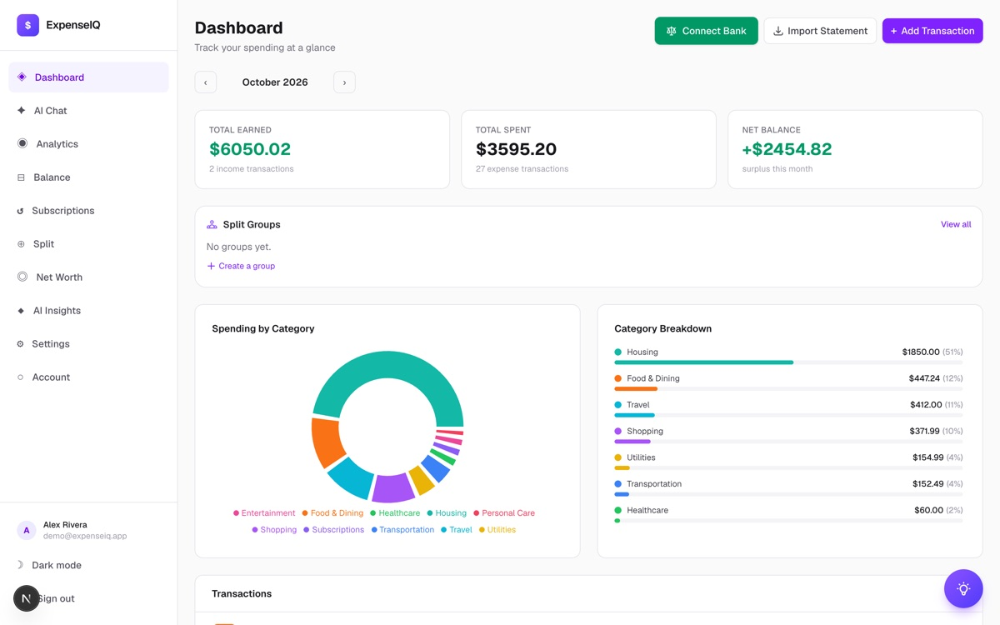
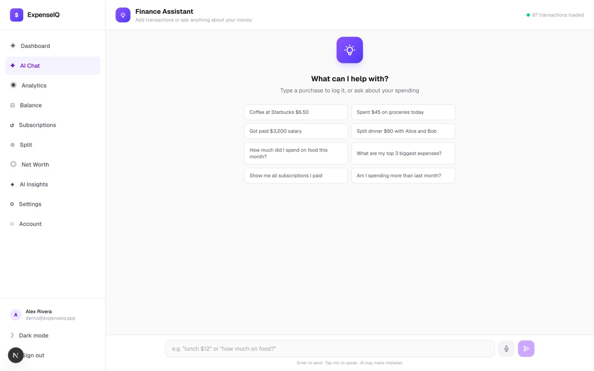
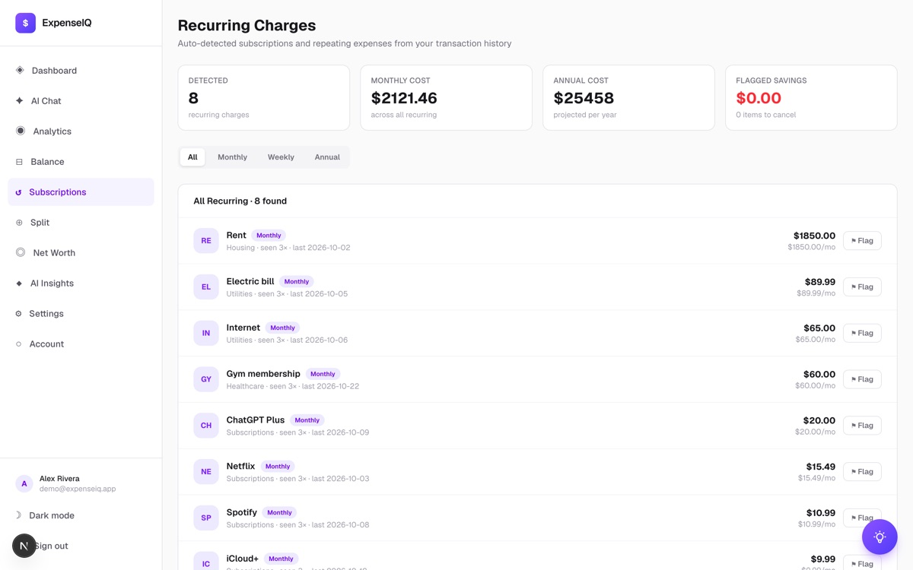
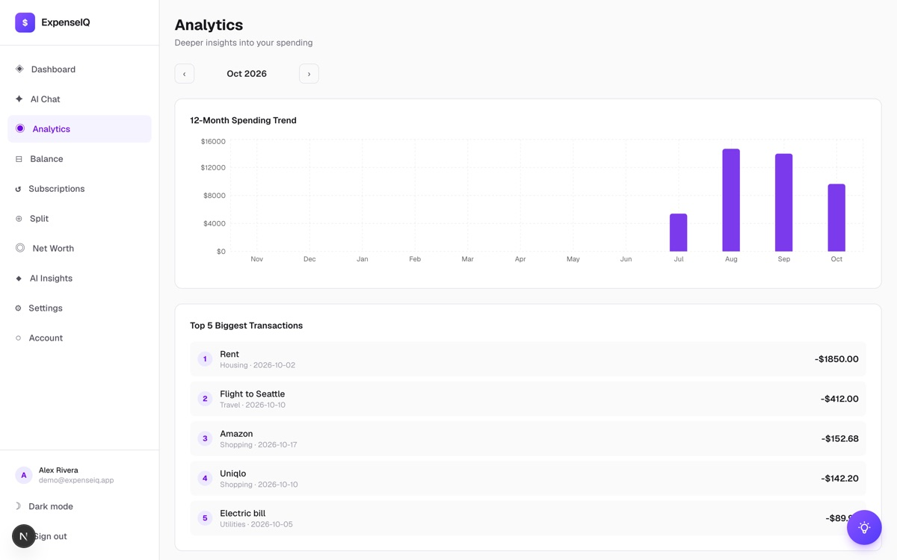
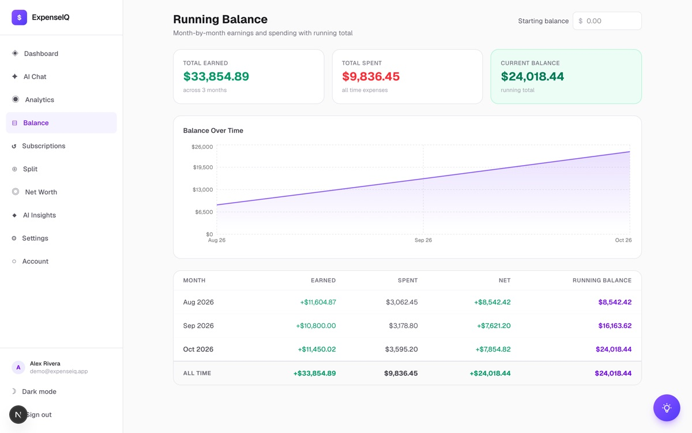

<div align="center">

# 💸 ExpenseIQ

**Money tracking you can just talk to.** *"Coffee at Starbucks $6.50."* *"Split dinner $80 with Alice and Bob."* *"Am I spending more than last month?"* ExpenseIQ logs it, sorts it, and tells you where your money really goes.




</div>

---

## Why ExpenseIQ?

Budgeting apps fail for one reason: logging is a chore. ExpenseIQ removes the friction. Type a sentence, connect your bank, or drop in a statement, and the categorizing, recurring-charge spotting and splitting happen for you.

## Features

| | |
|---|---|
| 💬 **AI chat assistant** | Log expenses and income in plain English, split bills, and ask questions about your spending. |
| 🏦 **Bank sync with Plaid** | Connect accounts and import transactions automatically. |
| 📄 **Statement import** | Upload a PDF, CSV or TXT bank statement and the transactions are parsed and imported. |
| 📊 **Analytics** | A 12-month spending trend, a category breakdown, and your five biggest transactions. |
| 🔁 **Recurring charge detection** | Finds subscriptions and repeating bills, totals the monthly and annual cost, and lets you flag ones to cancel. |
| 📈 **Running balance and net worth** | Month-by-month earned vs. spent with a running total, plus assets and liabilities in one number. |
| 👥 **Split groups** | Share expenses with friends, join a group by invite code, and see who owes whom. |
| 🧠 **AI insights** | Monthly summaries, cost-cutting tips, a playful "roast my spending", and your spending personality. |
| 🔐 **Secure sign-in** | Email and password with OTP verification, or Google, GitHub and Apple sign-in. |
| 🌙 **Dark mode** | Plus a matching **iOS app** (see [ExpenseIQ-iOS](https://github.com/roszhan2684/ExpenseIQ-iOS)). |

<p align="center">
  
  
</p>
<p align="center">
  
  
</p>

<sub>Screenshots use a demo account with three months of sample transactions.</sub>

## Tech

- **App:** Next.js 16 (App Router) + TypeScript + Tailwind, deployed on Vercel.
- **Data:** MongoDB with Mongoose models for users, transactions, split groups, Plaid items, net worth and settings.
- **Auth:** Auth.js (NextAuth) with credentials plus email OTP (Gmail SMTP), Google, GitHub and Apple.
- **AI:** a provider chain of local **Ollama**, then **Groq**, then **Google Gemini**, used for chat parsing, categorization and insights.
- **Banking:** the Plaid API with webhook-driven transaction sync.

## Run it locally

```sh
npm install
cp .env.example .env.local     # MONGODB_URI, NEXTAUTH_SECRET, OAuth, Plaid, AI keys
npm run dev                    # → http://localhost:3000
npx tsx scripts/create-admin.ts   # optional: create a first account
```

Only `MONGODB_URI` and `NEXTAUTH_SECRET` are required. Every other integration (OAuth, Plaid, AI, email) is optional.

## About

Built by **Roszhan Raj**, founder and full-stack developer.
